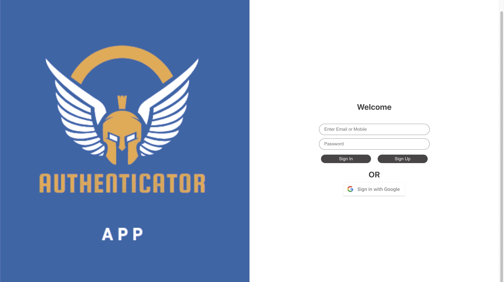
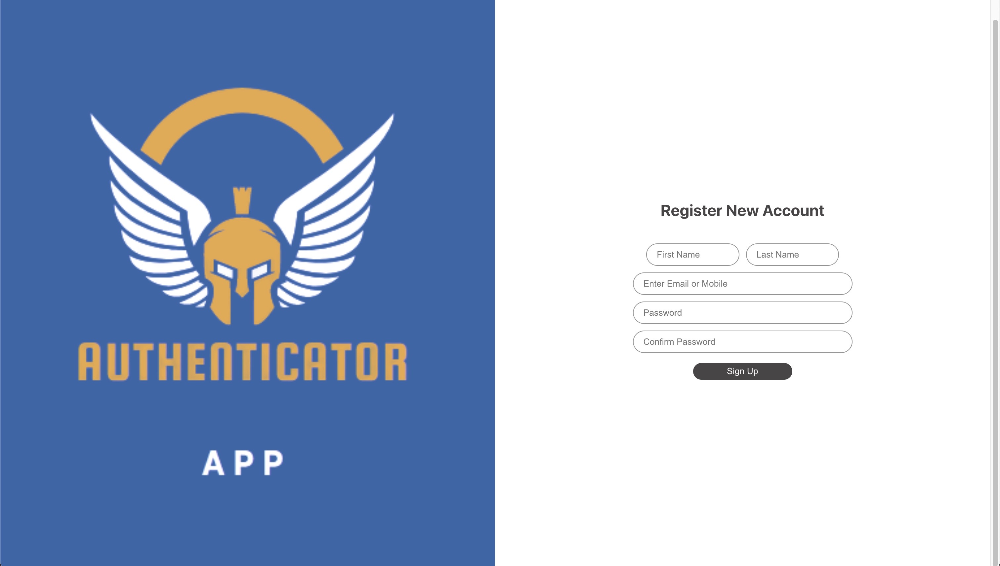

# Authentication App

## 🚀 About Me

I'm a CRUD authentication application created with React and Firebase

## Screenshots





## Run Locally

Clone the project

```bash
  git clone https://github.com/lypsa028/Authentication_App.git
```

Go to the project directory

```bash
  cd Authentication_App
```

Install dependencies

```bash
  npm install
```

Start the server

```bash
  npm start
```
